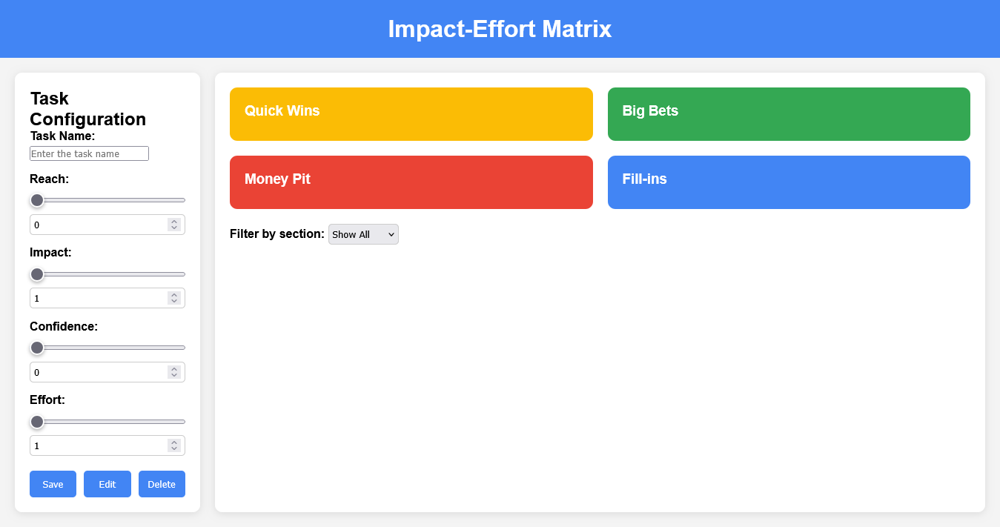

# Impact-Effort Matrix Prototype 🚀

Welcome to the **Impact-Effort Matrix Prototype**! This web application helps you prioritize tasks based on their impact and effort using a modified RICE scoring method. It's a powerful tool for decision-making and task management.

---

## Features ✨

- **Task Management**:
  - Add, edit, and delete tasks.
  - Automatically calculate RICE scores for tasks.
- **Dynamic Matrix**:
  - Tasks are categorized into four sections: **Big Bets**, **Quick Wins**, **Money Pit**, and **Fill-ins**.
  - Visualize tasks in a 2x2 grid with distinct colors for each section.
- **Customizable Inputs**:
  - Adjust task parameters: **Reach**, **Impact**, **Confidence**, and **Effort**.
  - Real-time synchronization between range sliders and numeric inputs.
- **Filtering**:
  - Filter tasks by section or show all tasks.
- **Legend**:
  - Get actionable insights based on the distribution of tasks in the matrix.

---

## How to Use 🛠️

1. **Add a Task**:
   - Enter the task name and adjust the sliders for **Reach**, **Impact**, **Confidence**, and **Effort**.
   - Click **Save** to add the task to the matrix.

2. **Edit a Task**:
   - Click on a task in the matrix to populate the input fields.
   - Modify the values and click **Edit** to update the task.

3. **Delete a Task**:
   - Select a task from the matrix and click **Delete** to remove it.

4. **Filter Tasks**:
   - Use the dropdown menu to filter tasks by section or show all tasks.

5. **Legend**:
   - Check the legend below the matrix for suggestions based on your task distribution.

---

## RICE Scoring Formula 📊

The RICE score is calculated using the following formula:

RICE Score = (Impact / Effort) + (Reach + Confidence) * 0.5
Copy

- **Impact** and **Effort** are the primary variables.
- **Reach** and **Confidence** have a smaller weight in the calculation.

Tasks are categorized as follows:
- **Big Bets**: RICE Score ≥ 10
- **Quick Wins**: RICE Score ≥ 5
- **Fill-ins**: RICE Score ≥ 2
- **Money Pit**: RICE Score < 2

---

## Technologies Used 💻

- **HTML**: Structure of the application.
- **CSS**: Styling and responsive design.
- **JavaScript**: Logic for task management and RICE score calculation.

---

## Installation 🛠️

No installation is required. Simply open the `index.html` file in your browser.

---

## Screenshots 📸

  
*The Impact-Effort Matrix in action.*

---

## Contributing 🤝

Contributions are welcome! Follow these steps:

1. Fork the repository.
2. Create a new branch (`git checkout -b feature/your-feature`).
3. Commit your changes (`git commit -m 'Add your feature'`).
4. Push to the branch (`git push origin feature/your-feature`).
5. Open a Pull Request.

---

## License 📜

This project is licensed under the MIT License. See the [LICENSE](LICENSE) file for details.

---

## Author 👤

- **Feith Noir**  
  Developer and tech enthusiast.  
  [GitHub](https://github.com/FeithNoir) | [Twitter](https://twitter.com/FeithNoir)

---

## Acknowledgments 🙏

- Inspired by the RICE prioritization framework.
- Thanks to the open-source community for tools and resources.

---

Enjoy using the **Impact-Effort Matrix Prototype**! If you have any questions or suggestions, feel free to reach out. 😄